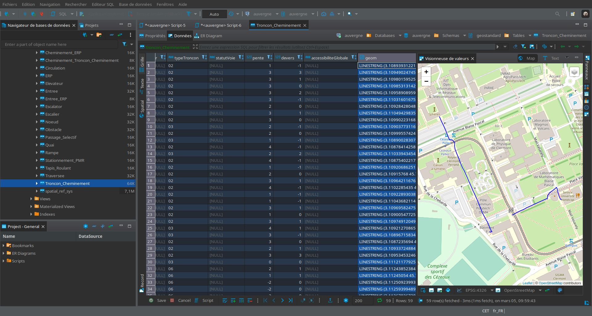

# Géostandard CNIG et OpenStreetMap

Ce dépôt contient des outils de manipulation de données d'accessibilité géostandard CNIG et OpenStreetMap (OSM).

> :warning: les outils présentés ici, et notamment le schéma des tables géostandard CNIG sont encore en cours de développement.

## À propos du géostandard CNIG
Le géostandard du CNIG a été proposé par le [GT Accessibilité](http://cnig.gouv.fr/?page_id=18058), et vise à proposer un cadre de description de l'accessibilité des infrastructures de mobilité piétonne.

L'implémentation du géostandard que nous proposons ici au format PostGIS contient pour certains types énumérés une possibilité supplémentaire par rapport au format proposé par le GT accessibilité, identifiée ```88```, et permettant de renseigner le fait que la donnée a été importée depuis une base de données (typiquement OSM) qui n'est pas assez précise pour pouvoir renseigner le champ.

## À propos d'OpenStreetMap

[OpenStreetMap](https://openstreetmap.org) est une base de données géographique collaborative, dont la précision et la qualité de la donnée est variable suivant les territoires. On pourrait avoir envie d'utiliser ces données pour alimenter une base au format géostandard CNIG, cependant il est important de noter que:

* l'ensemble des champs requis par le géostandard ne sont pas couverts par OpenStreetMap, même dans les territoires les plus détaillés, car la précision de sémantique (toujours en cours d'amélioration par la communauté) n'a pas atteint ce niveau de maturité.
* il peut manquer beaucoup de géométrie, notamment filaire piéton, la modélisation la plus répendue des trottoirs dans OpenStreetMap étant de la sémantique associée au filaire automobile.
* en partant des données OpenStreetMap, il faudrait donc entreprendre un travail de complément de la donnée. En l'état actuel des outils connus, il n'y a pas de manière efficace de réaliser ce complément. Un opérateur habitué à de la saisie complète de données d'accessibilité préférera souvent réaliser sa propre saisie complète plutôt que de consommer du temps à compléter et corriger celle qui existe. 
* l'équipe [Compas](https://compas.limos.fr) à l'origine du présent dépôt s'intéresse à la conception d'outils permettant une conversion et une saisie efficace. Il s'agit encore d'un travail en cours de développement, comme raconté sur la page [Géostandard CNIG et OpenStreetMap](https://compas.limos.fr/geostandard-CNIG-et-OSM/)..

## Prérequis

Les logiciels suivants sont requis pour créer une base de données au format géostandard CNIG:

* [PostGiS](https://postgis.net/) (version 3.1.1), et donc [PostgreSQL](https://www.postgresql.org/)
* [QGIS](https://www.qgis.org/) (version 3.20)

Les logiciels suivants peuvent faciliter la prise en main:

* [DBeaver](https://dbeaver.io/)

## Installation

Pour créer une base de données au format géostandard CNIG, on utilise le script SQL proposé sur le dépôt: [geostandard-CNIG.sql](postgis/geostandard-CNIG.sql).
Vous pouvez utiliser DBeaver pour cela, en l'ayant au préalable connecté à un serveur PostgreSQL via le [driver correspondant](https://dbeaver.com/docs/wiki/Database-drivers).


*TODO*

## Exemples de données

On trouve dans le répertoire [échantillons](/echantillons/) des jeux de données qui peuvent être chargés dans la base de données.

La capture d'écran ci-dessous montre l'interface de dbeaver avec un jeu de données chargé depuis le répertoire [échantillons](/echantillons/).



## Retours utilisateurs

N'hésitez pas à utiliser les [issues de ce dépôt github](https://github.com/jmtrivial/OSM-vers-geostandardCNIG/issues) pour tout retour utilisateur.

## Notes et références

Cet outil est conçu au [LIMOS](https://limos.fr) (Université Clermont Auvergne), par les membres de [Compas](https://compas.limos.fr). Les premières versions ont été réalisées dans le cadre d'un projet étudiant par Eunice Wadjom. On peut trouver [le code source initial](https://github.com/eunicewadjom/OSMCNIGProject) ainsi que le rapport de recherche associé: [Models transformation and data integration in OpenStreetMap for accessibility: feasibility study from the geostandard.](https://compas.limos.fr/files/Eunice_WADJOM_Research_Project_Report.pdf) (en).

On trouvera plus d'informations sur les liens entre OpenStreetMap et le géostandard du CNIG sur le site de Compas: [Géostandard CNIG et OpenStreetMap](https://compas.limos.fr/geostandard-CNIG-et-OSM/).

### Auteurs et autrices

* Eunice Wadjon
* Jérémy Kalsron
* Jean-Marie Favreau

