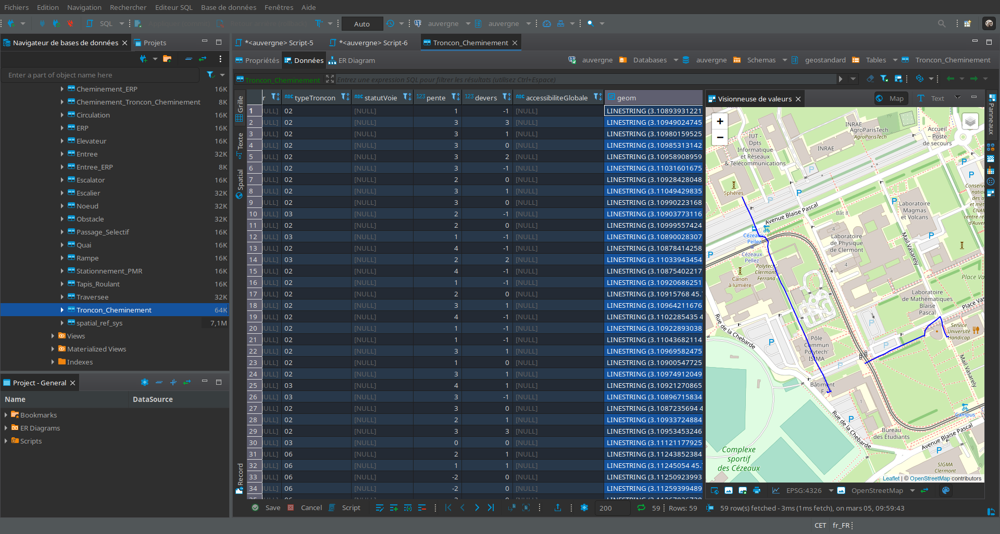

# Documentation

## Prérequis

Les logiciels suivants sont requis pour créer une base de données au format géostandard CNIG:

* [PostGiS](https://postgis.net/) (version 3.1.1), et donc [PostgreSQL](https://www.postgresql.org/)

Les logiciels suivants peuvent faciliter la prise en main et l'exploration de la base de données:

* [DBeaver](https://dbeaver.io/)
* [QGIS](https://www.qgis.org/) (version 3.20)


## Installation de la base PostGIS

Pour créer une base de données au format géostandard CNIG, commencer par créer une base de données PostGIS, puis y activer l'extension ```postgis``` dans le schéma ```public```.

Utiliser ensuite le script SQL proposé sur le dépôt: [geostandard-CNIG.sql](postgis/geostandard-CNIG.sql).

Vous pouvez utiliser DBeaver pour cela, en l'ayant au préalable connecté à un serveur PostgreSQL via le [driver correspondant](https://dbeaver.com/docs/wiki/Database-drivers).

On peut ensuite configurer QGIS pour qu'il se connecte à cette base de données. On peut alors explorer les différentes tables du nouveau schéma ```geostandard```: ```Noeud```, ```Troncon_Cheminement```, ```Obstacle``` et ```ERP```. Les autres tables n'ayant pas de géométrie associée, elles ne sont pas visibles directement dans QGIS.


## Import de données depuis OpenStreetMap

À titre expérimental, nous proposons dans ce dépôt un premier outil d'import de données OpenStreetMap dans la base de données au format géostandard.

On trouve sur la page [import-osm](import-osm.md) les détails d'installation, d'utilisation et les limitations de cet outil.

## Autres exemples de données

On trouve dans le répertoire [échantillons](/echantillons/) des jeux de données qui peuvent être chargés dans la base de données.

La capture d'écran ci-dessous montre l'interface de dbeaver avec un jeu de données chargé depuis le répertoire [échantillons](/echantillons/).
