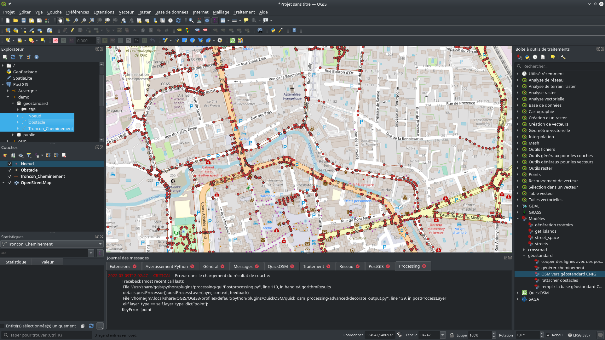

# Import de données OpenStreetMap dans une base PostGIS au format géostandard CNIG

L'import de données OpenStreetMap nécessite d'avoir d'abord configuré une base de données au format géostandard CNIG tel que présenté sur la page [documentation](documentation.md). Si vous avez utilisé le script ```SQL``` tel que nous le proposons, la base de données contient un schéma nommé ```geostandard```.

## Fonctionnement et limitations

L'ensemble de modèles que nous proposons réalise les étapes suivantes:

* télécharger les données de cheminement piéton de l'emprise depuis OpenStreetMap (en utilisant QuickOSM)
* travailler à la mise en forme de ce cheminement piéton sous forme de tronçons correspondant à la structure du géostandard
* télécharger les données des obstacles depuis OpenStreetMap (en utilisant QuickOSM)
* associer les obstacles aux tronçons les plus proches (dans la limite d'une distance passée en paramètre)
* convertir l'ensemble des données sémantiques au format géostandard
* vider la base de données PostGIS du géostandard, et y ajouter les données ainsi constuites.

L'outil d'import tel que nous le proposons ne sait pour l'instant importer que des cheminements piétons déjà existants dans OpenStreetMap. Or, cette modalité de modélisation n'est pas dominante dans OpenStreetMap, où l'on rencontre plus généralement les trottoirs décrits comme sémantique du filaire automobile. Dans les prochains mois, nous nous proposerons d'explorer les pistes de [génération de cheminements piétons](https://github.com/kauevestena/osm_sidewalkreator), comme moyen de mieux préparer la donnée.


## Installation

L'outil que nous proposons se compose d'un ensemble de modèles processing pour[QGIS](https://www.qgis.org/), que nous avons conçu pour la version 3.20 du logiciel, et fait fonctionner avec succès sous GNU/Linux. Nous sommes bien sûr intéressés à toute remarque, n'hésitez pas à utiliser les [issues de ce dépôt github](https://github.com/jmtrivial/OSM-vers-geostandardCNIG/issues).

Commencez par installer l'extension **QuickOSM** (nous avons utilisé la version 2.0.1).

Installez ensuite les fichiers ```.model3``` (récupérés dans le répertoire [scripts](qgis/)) dans le répertoire des modèles de votre logiciel QGIS. On peut trouver ce répertoire en allant dans les options des traitements (voir figure ci-dessous).


Il est également nécessaire de créer dans QGIS une nouvelle connexion à la base de données au format géostandard CNIG. Dans la suite de cette page, les captures d'écran montrent une base de données intitulée ```demo```.

## Utilisation

Commencez par charger un fond de carte permettant de vous repérer (par exemple le fond de carte OpenStreetMap XYZ), puis zoomez sur la zone que vous souhaitez traiter. 

> :warning: l'outil d'import tel que nous le proposons ne sait pour l'instant importer que des cheminements piétons déjà existants dans OpenStreetMap. Pour la démonstration, nous avons choisi de travailler sur la commune d'Orange (code INSEE 84087), car le centre-ville est précisément détaillé suivant cette modalité.


Dans la boîte à outils de traitements, repérer le traitement ```OSM vers géostandard CNIG```, localisé dans le groupe ```géostandard``` de l'entrée ```Modèles```.


Exécutez ensuite le traitement, et renseignez les entrées:

* le code INSEE de la commune, composé de 5 chiffres, qui sera utilisé pour générer les identifiants des données de la base géostandard
* la distance à laquelle un obstacle est considéré comme faisant partie d'un tronçon de cheminement
* l'emprise: dans cet exemple, nous avons choisi *l'emprise du canevas de la carte*, correspondant à la zone visible sur l'écran
* base de données PostGIS dans laquelle un schéma nommé ```geostandard``` contient une base de données au format géostandard CNIG


Le lancement s'exécute. Vous pourriez constater que le serveur Overpass met du temps à répondre. Il est possible d'en choisir un autre dans les réglages de QuickOSM. La fin des traitements comporte probablement une erreur, comme présent dans la capture d'écran ci-dessous (QuickOSM s'attend à charger des chemins pendant l'import des obstacles, mais il n'y en a pas).

Trois couches temporaires correspondant aux imports OSM sont alors visibles dans le projet. On peut les supprimer.


En naviguant dans l'explorateur, on retrouve la base de données PostGIS contenant le schéma ```géostandard```, et en particulier les trois couches ```Noeud```, ```Troncon_Cheminement``` et ```Obstacle```, que l'on peut charger dans le projet.




